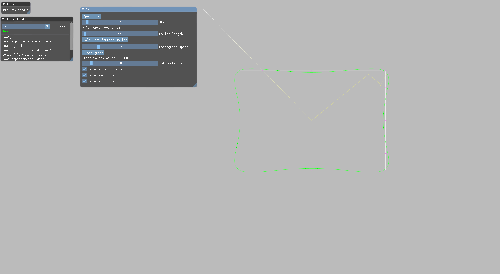
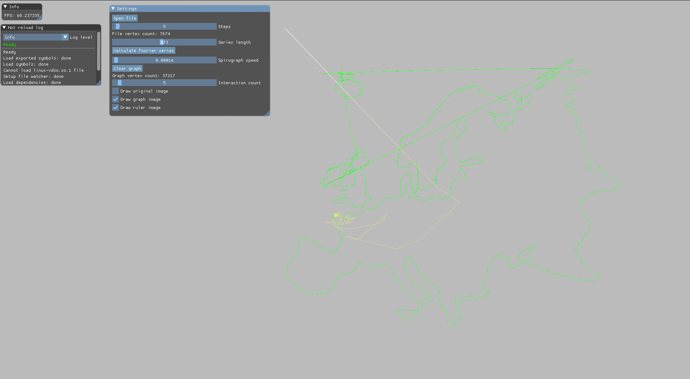
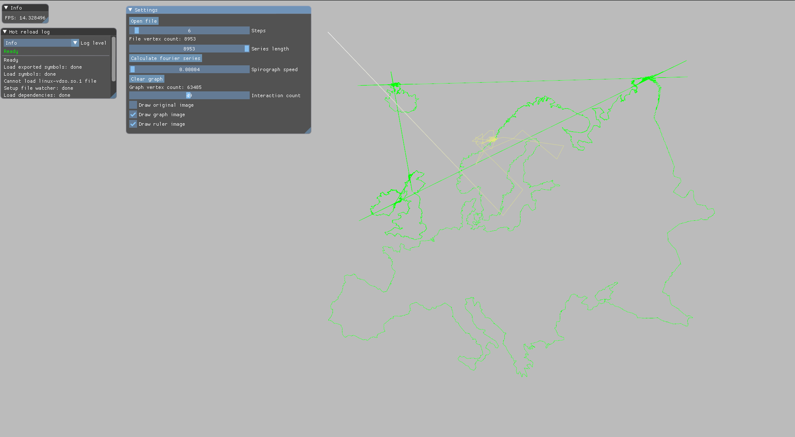

# Spirograph using the Fourier Series
Translates any SVG image into an approximation of it using the Fourier Series and renders it with a spirograph.
Inspired by 3Blue1Brown https://www.youtube.com/watch?v=r6sGWTCMz2k

## Dependencies
sfml, imgui, imgui-sfml, nanosvg, noc (file dialog)
Optional: cotire (speedup builds), jet-live (hot reload)

### Linux
```
sudo pacman -S sfml
mkdir dep && cd dep
git clone https://github.com/ocornut/imgui
git clone https://github.com/eliasdaler/imgui-sfml
git clone https://github.com/memononen/nanosvg
git clone https://github.com/guillaumechereau/noc
cat imgui-sfml/imconfig-SFML.h >> imgui/imconfig.h

# Optional
git clone https://github.com/sakra/cotire
git clone https://github.com/ddovod/jet-live
```

### Windows
TODO
follow the instructions at "Ingerating into your project manually" in imgui-sfml/README.md

## Building
### Linux
```
mkdir build && cd build
cmake ..
make
```

### Windows
```
mkdir build && cd build
cmake .. -DSFML_PATH=C:/src/sfml/SFML-2.5.1
msbuild ALL_BUILD.vcxproj
```

## Examples
Approximating a simple rectangle

Outline of Europe

A bit sharper


## Notes
I planned to run the calculations on another thread, but as it turns out the operations are relatively cheap and only spirographs bigger than 10^3 start to take some time.

The "series length" should not be set to values bigger than the "file vertex count".
